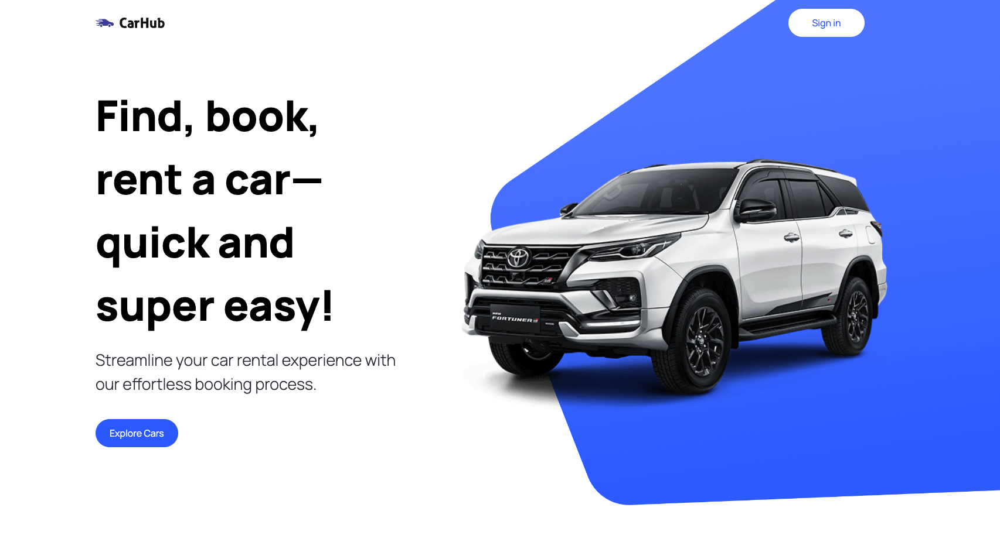

# Car Shop

The Car Shop is a modern web application that enables users to browse and purchase cars online. Built using React, this app provides a seamless user experience for car enthusiasts.

This is a [Next.js](https://nextjs.org/) project bootstrapped with [`create-next-app`](https://github.com/vercel/next.js/tree/canary/packages/create-next-app).



## Table of Contents

-   [Introduction](#introduction)
-   [Tech Stack](#tech-stack)
-   [Installation and Setup](#installation-and-setup)
-   [Usage](#usage)
-   [Features](#features)
-   [Pending Features](#pending-features)
-   [Documentation](#documentation)
-   [FAQs](#faqs)
-   [Learn More](#learn-more)
-   [Deploy on Vercel](#deploy-on-vercel)

## Tech Stack | React, Next JS 13, TypeScript, Tailwind CSS

-   **Frontend**: The frontend of the project is developed using React to create interactive and dynamic user interfaces.

-   **Data Integration**: The app connects to a backend API to retrieve car information and facilitate online purchases.

-   **Styling**: Custom styling is applied using CSS and potentially a styling library like Tailwind CSS for a visually appealing design.

## Installation and Setup

1. Clone the repository:

```bash
git clone https://github.com/abimael92/car_showcase.git
```

2. Navigate to the project directory:

```bash
cd car_showcase
```

3. Create a .env file in the root directory of the project.

```bash
touch .env
```

4. Add the following environment variables to the .env file:

-   **RAPID_API_BASE_URL**:https://cars-by-api-ninjas.p.rapidapi.com
-   **RAPID_API_KEY**:YOUR_RAPID_API_KEY
-   **IMAGIN_API_KEY**:YOUR_IMAGIN_API_KEY

Replace YOUR_RAPID_API_KEY and YOUR_IMAGIN_API_KEY with your actual API keys.

5. Install the dependencies:

```bash
npm install
```

6. Run the the development server:

```bash
npm run dev
```

7. Open [http://localhost:3000](http://localhost:3000) with your browser to see the result.

## Usage

The Car Shop App allows users to explore a wide range of cars available for purchase. Users can view detailed information about each car, including specifications, pricing, and images.

## Features

-   **Car Catalog:** Browse and search for cars by various criteria such as make, model, and price range.

-   **Car Details:** View comprehensive details about each car, including specifications, features, and high-quality images.

-   **User-Friendly Interface:** The app offers a clean and intuitive interface for easy navigation and information retrieval.

-   **Responsive Design:** The app is designed to provide a consistent and engaging experience across different devices and screen sizes.

## Pending Features

-   **Online Orders:** TUsers can add cars to their cart and place orders seamlessly within the app.

-   **User Profiles:** Registered users have access to their profiles, order history, and saved favorite cars.

## Documentation

-   Rapid-API [Cars by API-Ninjas]: https://cars-by-api-ninjas.p.rapidapi.com
-   cdn.imagin: https://cdn.imagin.studio/getimage

## FAQs

-   Q1: How can I search for cars?
-   A1: Use the search bar to enter criteria like make, model, or price range. The app will display matching cars.

-   Q2: What information can I find about each car?
-   A2: You can view detailed specifications, features, and high-quality images for each car.

-   Q3: Can I place an order for a car?
-   A3: The app is under development, and while it currently offers search and viewing capabilities, the ordering feature is pending.

## Learn More

To learn more about Next.js, take a look at the following resources:

-   [Next.js Documentation](https://nextjs.org/docs) - learn about Next.js features and API.
-   [Learn Next.js](https://nextjs.org/learn) - an interactive Next.js tutorial.

You can check out [the Next.js GitHub repository](https://github.com/vercel/next.js/) - your feedback and contributions are welcome!

## Deploy on Vercel

The easiest way to deploy your Next.js app is to use the [Vercel Platform](https://vercel.com/new?utm_medium=default-template&filter=next.js&utm_source=create-next-app&utm_campaign=create-next-app-readme) from the creators of Next.js.

Check out our [Next.js deployment documentation](https://nextjs.org/docs/deployment) for more details.
